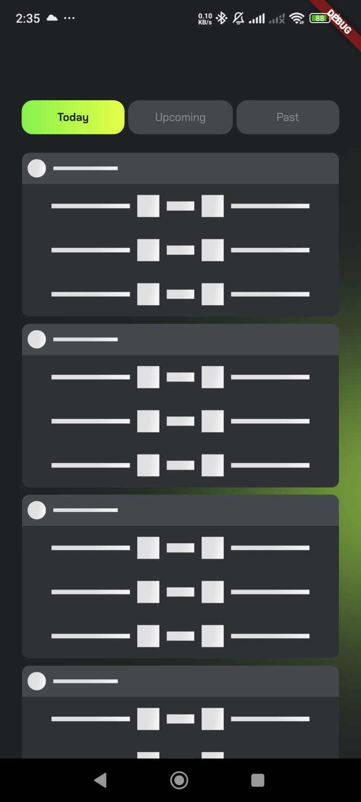
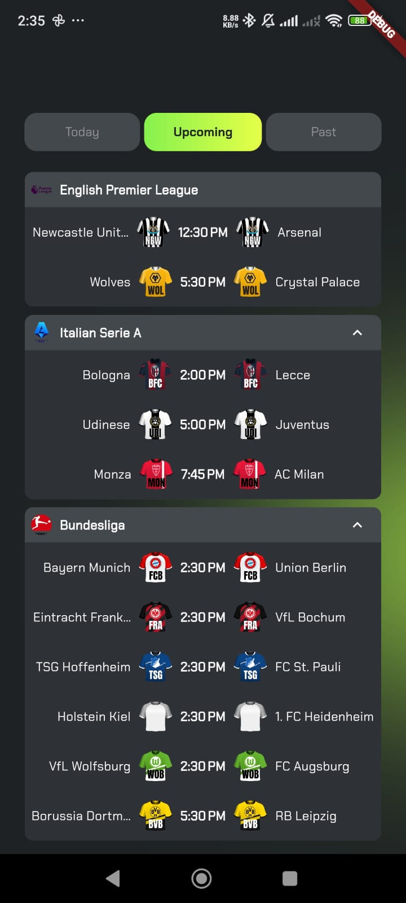

# Torliga Application

This repository contains the Flutter implementation of the Torliga app, structured for modularity and scalability.
The project is built with clean architecture principles, employing BLoC for state management, dependency injection, and well-organized layers for various functionalities.

## Project Structure

    The code is organized as follows:

    lib/
    ├── app/                              # App-level configurations and setup
    │ ├── app_bloc_providers.dart         # Sets up BLoC providers for dependency injection
    │ ├── app_injection_container.dart    # Dependency injection container for DI setup
    │ └── torliga_app.dart                # Main app entry point; initializes the app widget
    ├── config/                           # App configurations for routing and theming
    │ ├── router/                         # Defines navigation routes for the app
    │ └── theme/                          # Contains theme configurations and custom styles
    ├── core/                             # Core functionalities and utilities used across features
    │ ├── constants/                      # Defines app-wide constants (e.g., URLs, strings)
    │ ├── enums/                          # Enum definitions for standardizing app-wide values
    │ ├── exceptions/                     # Custom exception classes for error handling
    │ ├── extensions/                     # Extensions to enhance functionality of built-in classes
    │ ├── failure/                        # Handles error and failure management logic
    │ ├── network/                        # Networking layer for handling API requests
    │ ├── services/                       # Core services (e.g., authentication, data processing)
    │ ├── useCase/                        # Use case classes following clean architecture patterns
    │ └── utils/                          # General-purpose utility functions and helpers
    ├── features/                         # Features/modules of the app, each feature being modular
    │ ├── data/                           # Data layer of each feature following repository pattern
    │ │ ├── datasource/                   # Sources of data (e.g., local, remote API)
    │ │ ├── models/                       # Data models for deserializing API responses or data sources
    │ │ └── repository_impl/              # Implementations of domain repositories
    │ ├── domain/                         # Domain layer, defines entities and core business logic
    │ │ ├── entity/                       # Core entities representing feature data structures
    │ │ ├── repository/                   # Domain repository interface for dependency inversion
    │ │ └── usecases/                     # Use cases encapsulating core business rules
    │ └── presentation/                   # Presentation layer (UI) for each feature
    │   ├── bloc/                         # BLoC classes managing feature-specific state
    │   ├── screen/                       # UI screens/pages for user interaction
    │   └── widgets/                      # Reusable UI components/widgets for the feature
    └── main.dart                         # App's main entry point that bootstraps the app

## App Screenshots

_Splash Screen as like as Original Torliga_

_Loading Effect Screen as Like as Original Torliga_

_Upcoming Matches Screen_

## Download APK

You can download the APK of the Torliga application from the link below:

[Download Torliga APK](https://drive.google.com/file/d/1dAjBr0j_KMt2jiyjNJDaYbtXOoTZVjJD/view?usp=drive_link)
